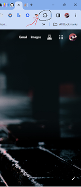
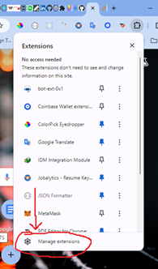

# Uploading Chrome Extension Locally

## Chrome Extension Setup (One-Time)

- ### Step one:- Enable Developer Mode
  -- Open Chrome and click on the extension icon.
  
  -- On the drop down click on `Manage Extension`
  
  -- Once on the chrome extension screen, toggle `Developer Mode` on the top right corner.

## Step two:- Load Unpack Extension

- ### Load from Directory:
  - Click the `Load unpacked` button in the top left corner.
  - Navigate to the directory containing your extension's `dist` folder and select it.
  - Or drag and drop the `dist` folder into the extension screen.

## Step three:- Run the Extension:

- Once loaded, locate your extension in the extensions list.
- Toggle the switch next to your extension's name to enable it.

## For every new update Dist folder.

- Remove the old extention by clicking on the remove button.
- Follow `Step two` and `Step three` above to add the updated one.
